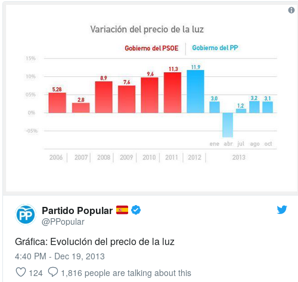

# Introducción al análisis de datos  {#intro}

En las siguientes secciones iremos desarrollando los elementos básicos de un análisis exploratorio, calculando medidas que nos ayuden a interpretar de forma adecuada el conjunto de datos analizados. Para ello utilizaremos varios conjuntos de datos que podrán ser descargados del [repositorio](https://github.com/AngelBerihuete/EstNavBook/tree/master/datasets) en GitHub.

Planteamos el siguiente problema sencillo: los precios (en euros) de un conjunto de botellas de vino en cierta sección de un centro comercial son los siguientes

42 42 42 42 42 42 42 42 42 42 42 42 42 42 42 42 42 42 42 42 43 43 43 43 43 43 43 43 43
43 43 43 43 43 43 52 52 52 52 52 52 52 52 52 52 52 52 52 52 52 52 52 52 52 52 53 53 53
53 53 53 53 53 53 53 62 62 62 62 62 62 62 62 62 63 63 63 63 63

Podríamos hacernos las siguientes preguntas:

1.  ¿Cómo preparo los datos para su análisis?

2.  ¿Qué representación gráfica hago de los datos?

3.  ¿Puedo elegir uno o varios valores que representen con garantías al conjunto de los datos?

4.  ¿Cómo puedo sistematizar el análisis de un conjunto de datos?


Un **análisis exploratorio de datos** implica el uso de los elementos numéricos y gráficos que describan lo más exhaustivamente posible un conjunto de datos. Además, deberá poner de manifiesto los aspectos más relevantes de la distribución de los datos: regularidades, datos atípicos, especificidades, relaciones, etc.

En este capítulo nos marcamos los siguientes objetivos:

- Ser capaces de identificar el tipo de variable estadística en estudio.

- Decidir qué tipo de medidas y gráficos serán los adecuados para resumir los diferentes tipos de variables estadísticas.

- Entender que **la media no siempre es la adecuada para resumir los datos**.

- Ser capaces de comparar diferentes medidas entre diferentes conjuntos de datos.

- Diferenciar entre **análisis exploratorio** de datos e **inferencia estadística**.


## Variables estadísticas

Las variables a analizar pueden ser de diferentes tipos:

- **Cualitativas** o **factores**: son variables no expresables numéricamente.

- **Cuantitativas**: pueden ser expresadas numéricamente. Las variables cuantitativas se subdividen en:

  1. **Cuantitativas Discretas**, si el conjunto de sus posibles valores tiene cardinal finito o infinito numerable. (Ejemplo: "Número de trabajadores en una bodega")

  2. **Cuantitativas Continuas**, si pueden tomar los infinitos valores de un intervalo.

A veces, por cuestiones prácticas, conviene discretizar las variables cuantitativas continuas. Por ejemplo la variable "Antigüedad del vino en una bota, medida en años".


## Distribuciones de frecuencias

A partir de un conjunto de datos queremos clasificarlos de modo que
la información contenida en ellos quede presentada de forma clara, concisa  y ordenada.

Si representamos por $N$ al número total de datos, entre los que consideraremos que hay $k$ valores distintos $x_1$, $x_2$,..., $x_k$ (que en el caso de las variables cuantitativas se presentarán ordenados de menor a mayor), se conoce como **frecuencia**:

- **Absoluta** del valor $x_i$, al número de veces que se presenta dicho valor en el conjunto de datos. Se representa por $n_i$.

- **Absoluta acumulada** del valor $x_i$, al número de datos que hay iguales o inferiores a $x_i$. Se representa por $N_i$.

- **Relativa** del valor $x_i$, al cociente $\dfrac{n_i}{N}$. Se representa por $f_i$.

- **Relativa acumulada** del valor $x_i$, al cociente $\dfrac{N_i}{N}$. Se representa por
$F_i$.

```{example, label="fluoruro", name="El problema del fluoruro"}


Para realizar un estudio sobre el contenido en ion fluoruro en vinos embotellados de  mayor comercialización en Canarias se procedió al análisis de 79 vinos embotellados de los cuales 50 son de la comunidad de Canarias y 29 de la Península. La siguiente tabla muestra los 10 primeros registros:

```{r, echo=FALSE}
library(readxl)
fluoruro <- read_excel("datasets/concentracion_fluoruro.xls")
fluoruro$Concentracion_F <- as.numeric(fluoruro$Concentracion_F)
colnames(fluoruro) <- c("denominacion", "tipo", "conc_fluor", "procedencia")
precios_base <- rep(c(42, 43, 52, 53, 62, 63), c(20, 15, 20, 10, 9, 5))
fluoruro$precio <- precios_base
```


```{r, echo=FALSE}
knitr::kable(head(fluoruro), format = 'html')
```


La tabla de frecuencias del factor `r colnames(fluoruro)[2]` que tiene niveles `r unique(fluoruro$tipo)`

```{r, echo=FALSE}
tab_Tipo <- as.data.frame(table(fluoruro$tipo))
tab_Tipo$CumFreq <- cumsum(tab_Tipo$Freq)
tab_Tipo$relFreq <- tab_Tipo$Freq/sum(tab_Tipo$Freq)
tab_Tipo$CumrelFreq <- cumsum(tab_Tipo$Freq/sum(tab_Tipo$Freq))
colnames(tab_Tipo) <- c("\\[ x_i \\]", "\\[ n_i \\]", "\\[ N_i \\]", " \\[ f_i \\] ", " \\[ F_i \\]")

knitr::kable(tab_Tipo, format = 'html', escape = FALSE, digits = 4, padding = 2)
```

siendo el gráfico más adecuado para esta variable el **diagrama de sectores** o el **diagrama de barras**.

```{r, echo=FALSE, fig.align='center'}
library(ggplot2)
data <- data.frame(Tipo = fluoruro$tipo)

data$Tipo <- reorder(data$Tipo, X = data$Tipo, FUN = function(x) -length(x))

at <- as.numeric(cumsum(sort(table(data)))-0.5*sort(table(data)))

label <- paste0(round(sort(table(data))/sum(table(data)),4) * 100,"%")

ggplot(data,aes(x="", fill = Tipo)) +
  geom_bar(width = 1) +
  coord_polar(theta="y") +
  annotate(geom = "text", y = at, x = c(1.2, 1.2, 1.2), label = label, size = 5) +
  labs(title = "Diagrama de sectores") +
    theme(
    plot.title = element_text(size = 30, face = "bold"),
    plot.subtitle = element_text(size = 25, face = "bold"),
    axis.title.x = element_blank(),
    axis.title.y = element_blank(),
    panel.border = element_blank(),
    panel.grid=element_blank(),
    axis.ticks = element_blank(),
    axis.text.x=element_blank(),
    legend.title=element_blank(),
    legend.text = element_text(size = 20))

```


```{r, echo=FALSE, fig.align='center'}
ggplot(data, aes(Tipo)) + geom_bar() + scale_y_continuous("Número de botellas") + labs(title="Diagrama de barras")
```

### Variables cuantitativas discretas

Tabla de frecuencias de la variable `r colnames(fluoruro)[5]`

42 42 42 42 42 42 42 42 42 42 42 42 42 42 42 42 42 42 42 42 43 43 43 43 43 43 43 43 43
43 43 43 43 43 43 52 52 52 52 52 52 52 52 52 52 52 52 52 52 52 52 52 52 52 52 53 53 53
53 53 53 53 53 53 53 62 62 62 62 62 62 62 62 62 63 63 63 63 63


```{r, echo=FALSE}
tab_precios <- as.data.frame(table(fluoruro$precio))
tab_precios$CumFreq <- cumsum(tab_precios$Freq)
tab_precios$relFreq <- tab_precios$Freq/sum(tab_precios$Freq)
tab_precios$CumrelFreq <- cumsum(tab_precios$Freq/sum(tab_precios$Freq))
colnames(tab_precios) <- c("\\[ x_i \\]", "\\[ n_i \\]", "\\[ N_i \\]", " \\[ f_i \\] ", " \\[ F_i \\]")
knitr::kable(tab_precios, format = 'html', escape = FALSE, digits = 4, padding = 2)
```

y el gráfico adecuado para este tipo de variable será el **diagrama de barras**:


```{r, echo=FALSE, fig.align='center'}
ggplot(fluoruro, aes(precio)) + geom_bar() + scale_y_continuous("Número de botellas") + labs(title="Diagrama de barras")
```

```{r, echo=FALSE}
tab_precios <- as.data.frame(table(fluoruro$precio))
tab_precios$CumFreq <- cumsum(tab_precios$Freq)
tab_precios$relFreq <- tab_precios$Freq/sum(tab_precios$Freq)
tab_precios$CumrelFreq <- cumsum(tab_precios$Freq/sum(tab_precios$Freq))
colnames(tab_precios) <- c("\\[ x_i \\]", "\\[ n_i \\]", "\\[ N_i \\]", " \\[ f_i \\] ", " \\[ F_i \\]")
knitr::kable(tab_precios, format = 'html', escape = FALSE, digits = 4, padding = 2)
```

### Variables cuantitativas continuas

La tabla de frecuencias de la variable cuantitativa continua `r colnames(fluoruro)[3]`

```{r, echo=FALSE}
tab_concen <- as.data.frame(table(cut(fluoruro$conc_fluor, breaks = c(0,0.20, 0.30, 0.40, 0.60))))
tab_concen$CumFreq <- cumsum(tab_concen$Freq)
tab_concen$relFreq <- tab_concen$Freq/sum(tab_concen$Freq)
tab_concen$CumrelFreq <- cumsum(tab_concen$Freq/sum(tab_concen$Freq))
colnames(tab_concen) <- c("\\[ ( l_{i-1}, l_i ] \\]", "\\[n_i\\]", "\\[N_i\\]", "\\[f_i\\]", "\\[F_i\\]")
knitr::kable(tab_concen, format = 'html', escape = FALSE, digits = 4, padding = 2)
```


Obsérvese que hemos agrupado en intervalos los valores 

0.13 0.07 0.10 0.11 0.26 0.12 0.20 0.17 0.08 0.14 0.17 0.13 0.16 0.16 0.15 0.28 0.18
0.20 0.09 0.13 0.13 0.06 0.13 0.22 0.12 0.14 0.12 0.17 0.12 0.50 0.15 0.22 0.13 0.20
0.18 0.13 0.10 0.10 0.18 0.09 0.15 0.15 0.08 0.11 0.16 0.17 0.10 0.09 0.15 0.18 0.25
0.26 0.27 0.28 0.28 0.29 0.27 0.27 0.28 0.44 0.37 0.46 0.24 0.28 0.33 0.37 0.46 0.22
0.28 0.38 0.29 0.27 0.29 0.29 0.36 0.23 0.32 0.36 0.45


El gráfico adecuado para este tipo de variable es el **histograma**:

```{r, echo=FALSE, fig.align='center'}
ggplot(fluoruro, aes(conc_fluor)) +
  geom_histogram(color="black", fill="white", breaks = c(0,0.20, 0.30, 0.40, 0.60)) +
  scale_y_continuous("Número de botellas") + scale_x_continuous("Concentración") + labs(title="Histograma")
```

<p>

</p>
<font color="red">¡Cuidado! Longitud de intervalos distinta.</font> Tendremos que utilizar la **densidad** $(h_i)$ para representar el histograma. Ahora la tabla de frecuencias de la variable cuantitativa continua `r colnames(fluoruro)[3]`

```{r, echo=FALSE}
breaks = c(0,0.20, 0.30, 0.40, 0.60)
tab_concen <- as.data.frame(table(cut(fluoruro$conc_fluor, breaks = breaks)))
tab_concen$CumFreq <- cumsum(tab_concen$Freq)
tab_concen$relFreq <- tab_concen$Freq/sum(tab_concen$Freq)
tab_concen$CumrelFreq <- cumsum(tab_concen$Freq/sum(tab_concen$Freq))
tab_concen$hi <- tab_concen$relFreq/(breaks[2:5]-breaks[1:4])
tab_concen$Var1 <- stringr::str_replace_all(tab_concen$Var1, "]", "&#93;")
colnames(tab_concen) <- c("\\[ ( l_{i-1}, l_i  ] \\]", "\\[n_i\\]", "\\[N_i\\]", " \\[f_i\\] ", " \\[F_i\\]", "\\[h_i\\]")
knitr::kable(tab_concen, format = 'html', escape = FALSE, digits = 4, padding = 2)
```

Siendo $h_i = \frac{f_i}{a_i}$


```{r, echo=FALSE, fig.align='center'}
ggplot(fluoruro, aes(conc_fluor, ..density.., pad = TRUE)) +
  geom_histogram(color="black", fill="white", breaks = c(0, 0.20, 0.30, 0.40, 0.60)) +
  scale_y_continuous("Densidad") + scale_x_continuous("Concentración") + labs(title = "Histograma")
```


### ¿Qué número de intervalos y qué amplitud es la adecuada?

No hay una fórmula con la que obtener un valor óptimo del número de intervalos y su amplitud. Existen muchas dependiendo de las hipótesis que hagamos en nuestro problema. Algunas de las más utilizadas si tenemos $N$ observaciones:

- $k = \sqrt{N}$  lo usa de forma predefinida el programa Excel.
- $k = \lceil \log_2 N \rceil +1$  lo usa de forma predefinida el programa R. Da resultados pobres si $n<30$ (Nota: $\lceil 2.4 \rceil = 3$).

Una vez tenemos el número de intervalos, basta calcular su amplitud mediante

$$ a = \frac{\max{x} - \min{x}}{k} $$


### ¿Pueden manipular nuestra opinión con los gráficos?

En general hay atentos a que todos los elementos de un gráfico estén representados adecuadamente. Algunos ejemplos de gráficos erróneos en los médios de comunicación podrían ser los siguientes: 

1. Los ejes no tiene la escala adecuada o están cortados


2. No se mantiene la escala en todo el gráfico




Se pueden encontrar todos estos gráficos y su expliacción en el diario [El País](https://verne.elpais.com/verne/2015/01/23/articulo/1422014607_223837.html) así como en  la cuenta de Twitter de [Kiko Llaneras](https://twitter.com/kikollan)


## Medidas de posición central

### Medias

- Una **media** es una medida de representación central que necesariamente debe cumplir tres requisitos:

  1.  Para su obtención deben utilizarse todas las observaciones.
  2.  Debe ser un valor comprendido entre el menor y el mayor de los
        valores de la distribución.
  3.  Debe venir expresada en la misma unidad que los datos.

La media aritmética se calcula mediante la fórmula

$$\overline{x}  =  \frac{\displaystyle\sum_{i=1}^N x_i}{N} = \frac{\displaystyle\sum_{i=1}^r x_i n_i}{N}  =   \sum_{i=1}^r x_i f_i$$

 Por ejemplo, la media aritmética de la variable cuantitativa discreta

```{r, echo=FALSE}
knitr::kable(tab_precios, format = 'html', escape = FALSE, digits = 4, padding = 2)
```


$$\bar{x} = \frac{\displaystyle\sum_{i=1}^r x_i n_i}{N} = \frac{42\cdot 20 + 43 \cdot 15 + \cdots + 63 \cdot 5}{20+15\cdots+5} = \frac{3928}{79}=49.7215$$


En el caso de  **variables continuas** agrupadas en intervalos tendremos que obtener  primero la **marca de clase**

$$x_i = \frac{l_{-1}+l_i}{2}$$


```{r, echo=FALSE}
tab_concen$x_i <- c(0.1, 0.25, 0.35, 0.5)
colnames(tab_concen)[7] <- "\\[ x_i \\]"
knitr::kable(tab_concen, format = 'html', escape = FALSE, digits = 4, padding = 2)
```


$$\bar{x}=\frac{ 0.1 \cdot 45 + 0.25 \cdot 22 + \cdots + 0.5 \cdot 5}{45+22\cdots+5} = \frac{14.95}{79}=0.1892$$


Otras medias que suelen utilizarse son:

-   **media geométrica**: $$\bar{x}_g  =  \sqrt[N]{x_1^{n_1} x_2^{n_2} \ldots x_r^{n_k}}$$

-   **media armónica**: $$\bar{x}_a  = \frac{N}{\displaystyle\sum_{i=1}^k\frac{n_i}{x_i}}$$

-   **media ponderada**: Se asigna a cada valor $x_i$ un peso $w_i$ que depende de la importancia relativa de cada uno de estos valores bajo algún criterio:

    $$\bar{x}_p = \frac{\sum_{i=1}^r n_iw_ix_i}{\sum_{i=1}^r n_iw_i}$$


### Propiedades de la media

1. Se cumple que $\sum_{i=1}^r (x_i  -  \bar{x})n_i =  0$

2. Dada una transformación lineal $Y  =  aX +  b$, se cumple que $\bar{y}  =  a \bar{x}  + b$.

Por ejemplo, si sabemos que la media de temperaturas en grados Celsius de cierta región es $\bar{x} = 15^{\circ} \mbox{C}$, ¿qué media en grados Farenheit tendrá dicha región?

$$\bar{y} = 1.8 \cdot 15 + 32 = 59^{\circ} \mbox{F},$$
porque el paso de una temperatura a otra se hace mediante la transformación $Y=1.8 X + 32$

3. La media es el valor $\phi$ que hace mínima la expresión:
    $$\sum_{i=1}^r (x_i - \phi)^2 n_i$$


### La mediana

La **mediana**, $M_e$, es un valor que, **una vez ordenados los datos**, deja la mitad de las observaciones a la izquierda de él y la otra mitad a la derecha.

El cálculo de la mediana en el caso de las **variables discretas** se realiza:

1. Si $N$ es impar, entonces $$M_e = x_{({\frac{n+1}{2}})}$$
2. Si $N$ es par, entonces $$M_e = \frac{x_{({\frac{n}{2}})}+x_{({\frac{n}{2}+1})}}{2}$$


Por ejemplo, en la siguiente tabla de frecuencias

```{r, echo=FALSE}
knitr::kable(tab_precios, format = 'html', escape = FALSE, digits = 4, padding = 2)
```

como $N$ es impar, entonces la mediana es el valor que ocupa la posición

$$\frac{79+1}{2} = \frac{80}{2} = 40$$

Mirando en la tabla $M_e = 52$

Sin embargo, en la siguiente tabla

```{r, echo=FALSE}
fluoruro <- fluoruro[1:78,]
tab_precios <- as.data.frame(table(fluoruro$precio))
tab_precios$CumFreq <- cumsum(tab_precios$Freq)
tab_precios$relFreq <- tab_precios$Freq/sum(tab_precios$Freq)
tab_precios$CumrelFreq <- cumsum(tab_precios$Freq/sum(tab_precios$Freq))
colnames(tab_precios) <- c("\\[ x_i \\]", "\\[ n_i \\]", "\\[ N_i \\]", " \\[ f_i \\] ", " \\[ F_i \\]")
knitr::kable(tab_precios, format = 'html', escape = FALSE, digits = 4, padding = 2)
```

como $N$ es par, entonces la mediana es la media de los valores que ocupan la posión $\frac{78}{2} = 39$ y $\frac{78}{2}+1 = 40$. Mirando en la tabla

$$M_e = \frac{52+52}{2} = 52$$

La mediana en variables continuas agrupadas en intervalos necesita de una fórmula. Por ejemplo, en el caso de la tabla de frecuencias:

```{r, echo=FALSE}
knitr::kable(tab_concen[,1:5], format = 'html', escape = FALSE, digits = 4, padding = 2)
```

El primer $N_i$ que es mayor o igual a $\frac{50 \cdot 79}{100} = 39.5$  es $N_1 = 45$, entonces $M_e$ está dentro del intervalo $(0, 0.2]$, por tanto

$$M_e = l_{i-1} + \frac{\frac{50 \cdot N}{100} - N_{i-1}}{N_i - N_{i-1}} \cdot a_i$$
$$M_e = 0 + \frac{\frac{50 \cdot 79}{100} - 0}{45 - 0} \cdot 0.2 = 0.1755$$


### La moda

-   La moda absoluta de una distribución es el valor que más veces se repite.

-   Además de la moda absoluta, aquellos valores que tengan frecuencia
    mayor a la de los valores adyacentes serán relativas.

En la distribución 2, 3, 3, 4, 6, 7, 7, 7, 10

-   $M_o= 7$ es la moda

-   $M_{o_r}=3$ es una moda relativa


La moda para variables discretas es sencillo. Miramos la frecuencia absoluta:

```{r, echo=FALSE}
knitr::kable(tab_precios, format = 'html', escape = FALSE, digits = 4, padding = 2)
```

En este caso, el valor que más se repite es $M_o = 42$

En el caso de variables continuas tendremos que utilizar una fórmula:

```{r, echo=FALSE}
knitr::kable(tab_concen, format = 'html', escape = FALSE, digits = 4, padding = 2)
```

En lugar de fijarnos en $n_i$ nos fijamos en $h_i$. Como el mayor $h_i$ es `r round(max(tab_concen[,6]),4)` la moda es

$$M_o = l_{i-1} + \frac{ h_{i+1} }{ h_{i-1}+h_{i+1} } \cdot a_i$$

$$M_o = 0 + \frac{2.7848}{0+2.7848} \cdot 0.2 = 0.2$$


## Medidas de dispersión

### Varianza y Desviación Típica

- La **varianza**, $S^2$, y su raíz cuadrada positiva, la **desviación típica**, $S$, son las medidas de dispersión más importantes.

  $S^2 = \frac{\sum_{i=1}^r (  x_i  - \bar{x})^2 n_i}{N} = \frac{\sum_{i=1}^r x_i^2 n_i}{N} - \bar{x}^2  \qquad  S=+\sqrt{S^2}$


1.  La desviación típica viene dada en las mismas unidades que la variable estadística.

2.  Tanto $S$ como $S^2$ son siempre no negativas y valen cero sólo en el caso de que todos los valores coincidan con la media.

3. Los valores atípicos influyen en las dos debido al cálculo de la media.


### Propiedades de la varianza

- Si $Y=aX  + b$ entonces se verifica $S_Y^2  =  a^2 S_X^2$. Por ejemplo

Dada $X$ con $\bar{x}=12$ y $S_X=9$, entonces para $Y=3X-4$:

$$\bar{y}=3\bar{x}-4=3\cdot 12-4=32$$
$$S_Y=\sqrt{a ^2}\cdot S_X=\sqrt{9}\cdot 9=27$$


### Coeficiente de Variación

$$C_v = \frac{S}{\mid \bar{x}\mid}$$

1.  Permite comparar la dispersión de varias distribuciones.

2.  Da información sobre la representatividad de la media. De forma orientativa, si el coeficiente de variación es menor o igual a 0.5 diremos que la media es representativa.


### Otras medidas de dispersión

-  El **rango** es la diferencia entre el mayor y el menor de los valores de la
    variable.

-  La **desviación media** $$D_m = \frac{\sum_{i=1}^r |  x_i - \bar{x} | n_i}{n}$$


### Desigualdad de Tchebychev  (para ampliar)

La desigualdad de Tchebychev proporciona una cota inferior para el porcentaje de observaciones en un determinado intervalo con centro la media de la distribución:

Dada una distribución con $\bar{x}=25$, y $S=4$, $[\bar{x}-3S,\bar{x}+3S]=[13,37]$ garantiza la presencia en su interior de, al menos, el $88.88\%$ de la distribución.


## Medidas de posición no central

Se llaman medidas de posición o de orden $k$ a aquellas que dividen a la distribución en $k$ partes, de tal forma que en cada una de esas partes haya el mismo número de elementos. Las más importantes son:

  -   Los **cuartiles**, $Q_i, i=1,2,3$ que dividen a la distribución en cuatro partes iguales.

  -   Los **deciles** , $D_i, i=1,2, \ldots, 9$ que dividen a la distribución en diez partes iguales.

  -   Los **percentiles**, $P_i, i=1,2, \ldots, 99$ que dividen a la distribución en cien partes iguales.


El cálculo de los percentiles será suficiente para calcular tanto los deciles como los cuartiles. En el caso de variables discretas:

- Si el $k\%$ de $N$, donde $N$ es el número de datos, es un número entero, $r$, entonces

$$P_k = \cfrac{x_r+x_{r+1}}{2}$$

- Si el $k\%$ de $N$ no es un número entero, lo redondeamos al siguiente, $r$, u entonces

$$P_k = x_r$$


Para el caso de datos agrupados en intervalos utilizaremos la fórmula:

$$P_k = l_{i-1} + \cfrac{\cfrac{k \cdot N}{100} - N_{i-1}}{N_i -N_{i-1}} \cdot a_i$$
donde $N_i$ es la primera frecuencia absoluta acumulada que cumple $N_i \geq \cfrac{k \cdot N}{100}$


### Diagrama de caja

Es una representación gráfica de los cuartiles:

- La caja representa el 50% central de la distribución, la línea situada en el interior de la caja es la mediana (algunos programas estadísticos representan también un símbolo que se corresponde con la media).

- La longitud de la caja es el **rango intercuartílico** $R_I =  Q_3  -  Q_1$

- Los extremos inferiores y superiores de los segmentos encierran los valores "normales".

- Los candidatos a valores anómalos se etiquetan como **atípicos** y se encuentran fuera del intervalo $(Q_1 - 1.5 \cdot R_I,Q_3 + 1.5 \cdot R_I)$:


```{r, echo=FALSE}
knitr::kable(tab_concen[,1:3], format = 'html', escape = FALSE, digits = 4, padding = 2)
```

Los percentiles 25, 50 y 75 de la concentración de fluoruro son
`r quantile(fluoruro$conc_fluor, 0.25)`, `r quantile(fluoruro$conc_fluor, 0.5)`,
`r quantile(fluoruro$conc_fluor, 0.75)` respectivamente. Además $1.5 \cdot R_I$ es `r 1.5 * (quantile(fluoruro$conc_fluor, 0.75) - quantile(fluoruro$conc_fluor, 0.25))`


```{r, echo=FALSE, fig.height=4, fig.align='center'}
ggplot(data = fluoruro, aes(x = "", y = conc_fluor)) + geom_boxplot() + coord_flip() + scale_y_continuous("")
```


## Medidas de forma

### Asimetría

- El **coeficiente de simetría** viene dado por: $$\gamma_1 = \frac{\sum_{i=1}^N (x_i - \bar{x})^3}{N \cdot S^3}$$

Observe que cuando la distribución es simétrica coinciden la media y la mediana. Si la distribución tiene además forma de campana, la media y la mediana se aproximan a la moda.


```{r, echo=FALSE, fig.align='center', fig.height=5}
x1 <- x <- rnorm(500, 2.5, 2)
x2 <- x[which(x>1.5)]
x3 <- x[which(x<3.5)]

data_skewness <- data.frame(valor = c(x1,x2,x3), dist = as.factor(rep(c(1,2,3), c(length(x1), length(x2), length(x3)))))

ggplot(data = data_skewness, aes(valor, ..density..)) +
  geom_histogram(colour = "black", fill="lightgray", bins = 10) +
  scale_x_continuous("") +
  scale_y_continuous("Densidad") +
  facet_grid(.~dist) +
  labs(title = "") +
  theme_bw()
```

En estos casos, la asimetría es, de izquierda a derecha, `r e1071::skewness(x1, type = 3)`, `r e1071::skewness(x2, type = 3)`, `r e1071::skewness(x3, type = 3)`, respectivamente.

### Curtosis

Para el cálculo de la curtosis utilizaremos $$\gamma_2  =  \frac{\sum_{i=1}^N (x_i - \bar{x})^4}{N \cdot S^4}-3$$

- $\gamma_2= 0$, distribución **mesocúrtica**

- $\gamma_2< 0$, distribución **platicúrtica**

- $\gamma_2> 0$, distribución **leptocúrtica**


```{r, echo=FALSE, fig.align='center', fig.height=5}
x1 <- rnorm(1000, 5, 1)
x2 <- rcauchy(1000, location = 0, scale = 0.005)
x3 <- runif(1000, 0, 1)

data_kurt <- data.frame(valor = c(x1,x2,x3), dist = as.factor(rep(c(1,2,3), c(length(x1), length(x2), length(x3)))))

ggplot(data = data_kurt, aes(valor, ..density..)) +
  geom_histogram(colour = "black", fill="lightgray", bins = 10) +
  scale_x_continuous("") +
  scale_y_continuous("Densidad") +
  facet_grid(.~dist, scales = 'free') +
  labs(title = "") +
  theme_bw()
```

En las distribuciones anteriores, y de izquierda a derecha, las curtosis tienen un valor de 

`r e1071::kurtosis(x1, type = 3)`, `r e1071::kurtosis(x2, type = 3)`, `r e1071::skewness(x3, type = 3)`, respectivamente.

Puede verse una aplicación de cómo el histograma y el diagrama de caja tienen un comportamiento similar ante diferentes formas de la distribución en la siguiente aplicación:

```{r, echo=FALSE}
knitr::include_app("https://berihuete.shinyapps.io/Histogram/", 
  height = "800px")
```


## Tipificación

A veces la distribución presenta muchas irregularidades, como asimetrías acentuadas, valores extremos, etc. En estos casos es recomendable efectuar una transformación que la haga más regular. Un caso particular de transformación es la **tipificación**.

Dada $X$ con media $\bar{x}$ y desviación típica $S$

$$Z  =  \frac{X  -  \bar{x}}{S}$$

A $Z$ se le llama variable o y tiene media 0 y desviación típica 1.

La tipificación tiene la propiedad de hacer comparables individuos que pertenezcan a distintas distribuciones, aún en el caso de que éstas vinieran expresadas en diferentes unidades.

Dos trabajadores del mismo sector ganan 620 y 672 euros, respectivamente. El primero pertenece a la empresa A, cuya retribución media y desviación típica vienen dados por: $\bar{x}_A= 580$ euros y
$S_{x_A} = 25$ euros, mientras que para la empresa del segundo trabajador se tiene: $\bar{x}_B$ =640 euros y $S_{x_B} = 33$ euros.

¿cuál de los dos ocupa mejor posición relativa dentro de su empresa?
$$z_A=\frac{620-580}{25}=1.6$$

$$z_B=\frac{672-640}{33}=0.97$$